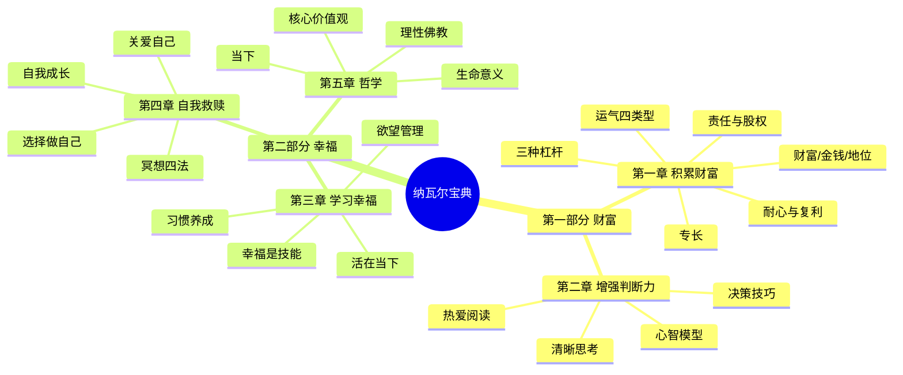

# 《纳瓦尔宝典》读书笔记

作者：埃里克·乔根森（整理）/ 纳瓦尔·拉维坎特（原著）　　领域：个人成长/商业哲学　　消化日期：2026-06-17

==========================================================
第一部分　一句话总结
==========================================================

财富和幸福都是可习得的技能：财富靠"专长+杠杆+责任"公式创造，幸福靠"减少欲望+活在当下+冥想修炼"获得。

==========================================================
第二部分　核心论点
==========================================================

【论点1】财富创造有公式可循，而非靠运气

主张：致富的核心公式是"专长+责任+杠杆"，三要素叠加才能实现财富自由。

论据：
  - 纳瓦尔自身从印度贫困移民到硅谷顶级天使投资人，AngelList创始人，投资Twitter、Uber等200+公司，身家数亿美元
  - 新一代亿万富翁多通过"零边际成本产品"（代码和媒体）致富，而非传统劳动力或资本杠杆
  - "追求财富，而非地位"——财富是正和游戏，地位是零和游戏

推理链：专长提供不可替代性，责任带来股权回报，杠杆放大产出规模，三者缺一则无法突破时间换钱的收入天花板

评价：9/10　纳瓦尔以自身经历验证了公式的可行性，且逻辑自洽；但公式中"专长"的发现过程缺乏可操作步骤

【论点2】代码和媒体是普通人最易获得的杠杆

主张：在三类杠杆中，代码和媒体是唯一无需许可的杠杆，是数字时代普通人翻身的最大机会。

论据：
  - 劳动力杠杆需要有人愿意追随你，资本杠杆需要有人愿意给你钱，两者都需要"许可"
  - 代码和媒体可以24小时运转、无限复制，边际成本趋近于零
  - 纳瓦尔名言："如果不会写代码，那就出书、写博客、做视频、录播客"

推理链：互联网降低了分发门槛，个人不再需要出版社或电视台的许可即可触达全球受众，一次创作可无限复制分发

评价：8/10　洞察深刻且极具时代性，但对"如何让代码/媒体真正产生收入"的实操路径着墨不足

【论点3】幸福是一种可训练的技能，而非外在条件的结果

主张：幸福不依赖于财富、地位或关系，而是通过减少欲望、活在当下、培养内心平和来获得的一种可习得技能。

论据：
  - 纳瓦尔公式：幸福=现实-期望。期望越低，幸福越高
  - "欲望是你与自己签订的合同：在得到想要的东西之前，你一直不快乐"
  - 纳瓦尔亲身实践冥想多年，从焦虑的创业者转变为内心平静的思考者

推理链：焦虑源于对未来的担忧，抑郁源于对过去的执念，而只有当下是真实存在的。通过冥想和正念训练观察念头、减少欲望，就能回到默认的幸福状态

评价：8/10　与斯多葛学派、佛教哲学一脉相承，实践性强；但对"如何在现实压力下维持幸福"的讨论偏理想化

【论点4】判断力在杠杆时代比勤奋更重要

主张：当杠杆将个人产出放大百倍千倍时，一个正确决策的价值远超千小时勤奋劳动。

论据：
  - 杠杆是判断力的倍增器——同样1%的判断力提升，在1000倍杠杆下产生的价值差异巨大
  - 纳瓦尔举例：一个CEO每天只做3-5个关键决策，但其影响远超100个工程师的日常产出
  - 培养判断力的方法：学习基础学科（数学、逻辑、进化论、心理学）、大量阅读经典、与聪明人共事

推理链：杠杆放大产出规模，判断力决定产出方向，方向正确时杠杆才能产生正回报，方向错误时杠杆反而加速亏损

评价：7/10　逻辑成立，但对"如何量化判断力"和"判断力的训练方法"缺乏具体框架

【论点5】理性佛教是现代人最适合的哲学框架

主张：保留佛教关于无常、无我、痛苦根源的核心洞察，但抛弃轮回、因果报应等超自然部分，用科学理性重新诠释。

论据：
  - 纳瓦尔个人实践：冥想多年但不接受宗教教条，验证了正念对内心平静的效果
  - 佛教的"无常"观与现代科学的宇宙热寂理论一致——万物终将消散
  - "佛教不是宗教，而是一种心理学——关于如何管理思想和情绪的方法"

推理链：佛教提供了体验验证的内心修炼方法，科学理性提供了对外部世界的认知框架，两者互补而非矛盾

评价：7/10　融合思路有启发性，但对"理性"与"佛教"之间张力的处理过于简单化

==========================================================
第三部分　章节框架
==========================================================

==========================================================
第四部分　章节摘要
==========================================================

【第一部分】第一章 积累财富

  *本章是全书的核心理论基础。纳瓦尔从自身经历出发——从印度贫困移民到硅谷顶级投资人——系统拆解了"不靠运气致富"的完整路径。核心论断是：财富、金钱、地位是三种完全不同的东西。财富是你睡觉时仍能为你赚钱的资产（股权、代码、媒体内容），金钱只是转移财富的工具，地位则是社会等级中的位置——追求财富是正和游戏，追求地位是零和游戏。致富的关键在于找到专长（无法被培训的独有知识）、承担责任（以个人名义承担风险，获取股权回报）、利用杠杆（放大产出的工具）。*

  【专长】专长是"无法通过培训获得的知识"，它源于你的天赋、好奇心和独特经历的组合。判断方法：对你像玩耍、对别人像工作的事就是你的专长。纳瓦尔强调，如果社会能培训你做某事，它也能培训别人来取代你，因此标准化教育获得的技能不算专长。寻找专长要回溯童年——你小时候自然沉浸其中的事情往往指向你的天赋。

  【三种杠杆】杠杆分为劳动力（他人为你工作）、资本（钱为你工作）、零边际成本产品（代码和媒体为你工作）三类。前两者需要"许可"——有人愿意出资、有人愿意追随你；第三种无需许可，是普通人最大的机会。纳瓦尔说："有一大批机器人可供我们免费使用，它们就集中放在数据中心。"互联网将分发成本降至接近零，一次创作可无限复制传播。

  【责任与股权】以个人名义承担风险，社会会以责任、股权和杠杆作为回报。不敢担责的人只能拿固定工资。纳瓦尔建议：学会销售、学会构建，两技傍身势不可当。

  【运气四类型】运气分为四种：盲运（纯随机）、坚持之运（通过折腾增加概率）、善于发现之运（通过敏锐观察捕捉机会）、人品之运（通过打造独特品牌让运气找上门）。第四种是最高级形式。

  【复利与耐心】所有回报——财富、人际关系、知识——都来自复利。选择长期合作的行业和人，保持耐心，不要急于求成。"如果你在计数，你会在成功到来之前失去耐心。"

> "Seek wealth, not money or status. Wealth is having assets that earn while you sleep." —— Naval Ravikant

> "Code and media are permissionless leverage. They're the leverage behind the newly rich." —— Naval Ravikant

【第一部分】第二章 增强判断力

  *本章讨论在杠杆时代如何提升决策质量。纳瓦尔认为，判断力比勤奋更重要——当杠杆放大了个人产出1000倍时，1%的判断力提升就意味着巨大的价值差异。清晰思考的前提是摆脱自我束缚，即放下预设立场和身份认同，让事实说话。纳瓦尔推崇的心智模型包括：进化论（理解人类行为的底层逻辑）、博弈论（理解利益博弈）、复杂性理论（理解系统行为），以及查理·芒格的多元思维模型。*

  【清晰思考】清晰思考需要摆脱"自我"的束缚——当你认同某个观点时，就会不自觉地过滤掉反面证据。纳瓦尔的建议：把"我"和"我的观点"分开，当新证据出现时，应该乐于改变观点而不是捍卫旧立场。

  【决策技巧】如果两个选项难以抉择，选短期更痛苦的那个——长期来看，短期痛苦往往对应长期收益。如果答案是不确定的，答案就是否定的——对于重大决策，确定性不够就不做。设定高时薪（如500美元/小时），任何低于这个价值的事就外包或不做。

  【热爱阅读】阅读是构建心智模型最重要的方式。纳瓦尔建议：读经典而非新书、读基础学科而非商业畅销书、不要害怕放弃一本不好的书。阅读重在思考和吸收，而非速度和数量。他推荐的核心学科：数学、逻辑、进化论、微观经济学、心理学。

> "Read what you love until you love to read." —— Naval Ravikant

> "The person who reads too much and uses his own brain too little falls into lazy habits of thinking." —— Naval引用爱因斯坦

【第二部分】第三章 学习幸福

  *本章是全书转折点，从财富创造转向内心修炼。纳瓦尔的核心观点颠覆了常人的直觉：幸福不是财富和成功的结果，而是一种可以训练的内在技能。他用一个简洁的公式表达：幸福=现实-期望。期望越高，现实与期望之间的落差越大，人就越不幸福。焦虑来自对未来的担忧，抑郁来自对过去的执念，而只有当下是真实存在的——因此"活在当下"不是心灵鸡汤，而是理性的生存策略。*

  【幸福是技能】幸福不是兴奋或快乐——兴奋必然伴随低谷，快乐之后是空虚。纳瓦尔定义的幸福是"内心的平和"，是一种不需要外部条件的默认状态。他认为婴儿天生平和，焦虑和欲望是后天习得的，因此可以通过"去学习"来恢复。

  【欲望管理】"欲望是你与自己签订的合同：在得到想要的东西之前，你一直不快乐。"纳瓦尔建议一次只保留一个核心欲望，其余全部放下。嫉妒是幸福的敌人——嫉妒让你迷失方向，忘了自己真正需要什么。

  【幸福习惯】幸福需要像健身一样训练。具体方法：与快乐的人相处（你最常相处的五个人决定了你的幸福基线）、有意识地从任何处境中找积极面、照顾好身体（健康是幸福的基石）、冥想（观察念头而非被念头控制）。

  【接受】幸福最终来自于接受——接受自己无法改变的事，接受现实的本来面目，而非执着于"应该是"。纳瓦尔说："于接受中寻找幸福，而不是于抗争中。"

> "Happiness is a choice and a skill — and you can dedicate yourself to learning that skill." —— Naval Ravikant

> "Desire is a contract you make with yourself to be unhappy until you get what you want." —— Naval Ravikant

【第二部分】第四章 自我救赎

  *本章从理论转向实践，给出具体的自我修炼方法。纳瓦尔认为，"救赎"不是等待外力拯救，而是主动选择成为更好的自己。核心行动包括：选择做自己（而非他人期待的你）、关爱自己（健康优先于一切）、冥想（四种方法）、自我塑造（选择长期正确的事）、自我成长（持续学习）、解放自己（摆脱社会期望和内心牢笼）。纳瓦尔将健康置于最高优先级：健康大于财富大于其他一切。*

  【选择做自己】不要试图成为别人。纳瓦尔说："通过做真正的自己来摆脱竞争。"当你做自己时，没有人能在"做你"这件事上跟你竞争。

  【关爱自己】健康优先级：锻炼、饮食、睡眠。纳瓦尔特别强调冥想的价值——不是"清空大脑"，而是"成为念头的观察者"。

  【冥想四法】无选择觉知（不做评判，全盘接受）、超觉冥想（默念静坐，制造白噪声掩盖杂念）、觉察（敏锐观察自己的想法，识别恐惧源头）、接受（每天静坐一小时，臣服于发生的一切）。纳瓦尔认为第四种最难但效果最深远。

  【自我成长】选择解放自己——摆脱对他人评价的恐惧、摆脱社会对"成功"的定义、摆脱内心的自我束缚。纳瓦尔的人生优先级：健康第一，爱第二，使命第三。

> "The most important trick to be happy is to realize that happiness is a choice." —— Naval Ravikant

【第二部分】第五章 哲学

  *本章是全书的哲学升华，讨论生命的终极问题。纳瓦尔提出了三种关于生命意义的视角：第一，意义是私人问题，每个人必须自己探索；第二，从宇宙尺度看，生命没有预设意义（热力学第二定律，万物终归热寂）；第三，生命的意义可能在于"局部熵减"推动整体熵增，加速宇宙走向"万物一体"。纳瓦尔的核心价值观：诚实（做真实的自己）、长期思维（所有回报来自复利）、平级关系（拒绝等级思维）、愤怒毫无意义（"执怒如握热炭，伤己甚于伤人"）。他提出"理性佛教"——保留佛教关于无常、无我、痛苦根源的洞察，但抛弃轮回等超自然部分。最终结论：我们唯一拥有的就是当下。*

  【生命意义】纳瓦尔不给出确定答案，而是提供三种思考框架供读者自行探索。他强调："意义不是被发现的，而是被创造的。"

  【核心价值观】诚实、长期思维、平级关系、拒绝愤怒。人生优先级：健康大于爱大于使命。每年重新审视价值观清单。

  【理性佛教】保留佛教核心（无常、无我、痛苦源于执着），抛弃超自然部分（轮回、因果报应）。纳瓦尔说："佛教不是宗教，而是心理学——关于如何管理思想和情绪的方法。"这与现代正念科学高度一致。

  【当下】"过去和未来只存在于你的脑海中，唯一真实的只有当下这一刻。"死亡唯一的含义是"不再有未来的时刻"，因此行动应当及时。智慧的定义："知道个人行为的长期后果的思维能力。"

> "The present is all we have." —— Naval Ravikant

> "Wisdom is the ability to know the long-term consequences of your actions." —— Naval Ravikant

==========================================================
第五部分　关键概念索引
==========================================================

财富（第一章）
  在你睡觉时仍能为你赚钱的资产。包括企业股权、知识产权、自动运行的代码或媒体内容。与金钱（转移财富的信用符号）和地位（社会等级中的位置）截然不同。追求财富是正和游戏——你创造价值的同时并不剥夺他人的价值；追求地位是零和游戏——你的上位必然意味着他人的下位。纳瓦尔主张追求财富而非地位。

专长（第一章）
  无法通过标准化培训获得的知识和技能。它源于个人的天赋、好奇心和独特经历的组合，因此无法被外包或自动化。判断专长的方法：对你像玩耍、对别人像工作的事情就是你的专长。纳瓦尔强调"如果社会能培训你做某事，它也能培训别人来取代你"，因此学校教的标准化技能不算专长。寻找专长要回溯童年——你自然沉浸其中、愿意免费做的事情往往指向你的天赋所在。

杠杆（第一章）
  放大个人产出和影响力的工具。分为三类：劳动力杠杆（他人为你工作）、资本杠杆（钱为你工作）、零边际成本产品杠杆（代码和媒体为你工作）。前两者需要"许可"——有人愿意出资或追随你；第三种无需许可，是数字时代普通人最大的机会。纳瓦尔名言："杠杆是判断力的倍增器。"

责任（第一章）
  以个人名义承担风险的行为。社会会以责任、股权和杠杆作为回报。不敢担责的人只能拿固定工资，无法获得股权和杠杆带来的超额收益。纳瓦尔建议：学会销售和构建，两技傍身势不可当；把名字放在工作上，建立个人品牌。

判断力（第二章）
  在杠杆时代比勤奋更重要的能力。杠杆放大产出规模，判断力决定产出方向——方向正确时杠杆产生正回报，方向错误时杠杆反而加速亏损。培养判断力的方法：学习基础学科（数学、逻辑、进化论、微观经济学、心理学）、大量阅读经典、与聪明人共事、在重要决策上花更多时间。

幸福（第三章）
  纳瓦尔定义的幸福不是兴奋或快乐，而是"内心的平和"。公式：幸福=现实-期望。幸福不是财富和成功的结果，而是一种可以训练的内在技能，通过减少欲望、活在当下、冥想练习来获得。焦虑来自对未来的担忧，抑郁来自对过去的执念，只有当下是真实存在的。

欲望（第三章）
  "欲望是你与自己签订的合同：在得到想要的东西之前，你一直不快乐。"纳瓦尔认为欲望是后天习得的，是痛苦的根源。建议一次只保留一个核心欲望，其余全部放下。嫉妒是幸福的敌人——它让你迷失方向，忘了自己真正需要什么。

冥想（第四章）
  不是"清空大脑"，而是"成为念头的观察者"。纳瓦尔介绍四种方法：无选择觉知（不做评判，全盘接受，散步15分钟即可达到平和状态）、超觉冥想（默念静坐，制造白噪声掩盖杂念）、觉察（敏锐观察自己的想法，识别恐惧源头，恐惧一旦被识别就自然消散）、接受（每天静坐一小时，臣服于发生的一切）。第四种最难但效果最深远。

理性佛教（第五章）
  纳瓦尔的核心哲学框架。保留佛教关于无常（万物皆变）、无我（自我是幻觉）、痛苦根源（执着和欲望）的核心洞察，但抛弃轮回、因果报应等超自然部分。用现代科学和理性思维重新诠释佛教——"佛教不是宗教，而是心理学"。与当代正念科学高度一致，也为理性的现代人提供了接受冥想实践的入口。

复利（第一、五章）
  不仅适用于财富，也适用于人际关系和知识。所有回报——财富、关系、认知——都来自复利效应。因此要选择长期合作的行业和人、坚持阅读和学习、保持耐心。纳瓦尔认为这是最被低估的力量：人际关系的复利效应在十年后会产生超乎想象的回报。

==========================================================
第六部分　评价及关联推荐
==========================================================

【本书评价】
  - 阅读难度：3/10　语言简洁直白，语录体形式易于阅读
  - 内容深度：6/10　思想密度高但缺乏系统性论证，多为断言式箴言
  - 原创性：7/10　对财富公式的提炼、杠杆分类、理性佛教等有独到见解
  - 实用性：8/10　可直接应用于职业选择、杠杆构建和幸福修炼
  - 推荐指数：8/10

【适合人群】
  - 想要理解财富创造底层逻辑的职场人和创业者
  - 对冥想和正念感兴趣的理性思维者
  - 感到焦虑、内耗严重，想要找到内心平静方法的人

【不足之处】
  - 语录体导致论证碎片化，缺乏系统性推演和反例讨论
  - "专长"的发现过程缺乏可操作的步骤，容易让人感到"听起来对但不知怎么做"
  - 对幸福的讨论偏理想化，对现实压力下维持幸福的实操路径着墨不足
  - 纳瓦尔的个人经验（硅谷顶级投资人）可能与普通人处境差距较大，部分建议有幸存者偏差

【关联推荐】

  同类入门：
    1.《原子习惯》詹姆斯·克利尔——习惯养成与自我提升的系统方法论，弥补本书实操不足
    2.《思考，快与慢》丹尼尔·卡尼曼——判断力与认知偏误的深度科学，是本书"判断力"论点的底层支撑

  深度进阶：
    3.《穷查理宝典》查理·芒格——多元思维模型和决策框架的系统性论述，是本书"心智模型"论点的进阶版
    4.《反脆弱》纳西姆·塔勒布——关于不确定性、杠杆和风险的深度思考，弥补本书对风险讨论的不足

  视角补充（弥补本书盲区）：
    5.《了不起的我》陈海贤——中文语境下的自我发展心理学，弥补本书对普通人现实困境讨论的不足
    6.《正念的奇迹》一行禅师——冥想和正念的传统佛教诠释，弥补本书"理性佛教"对传统智慧讨论的简化
